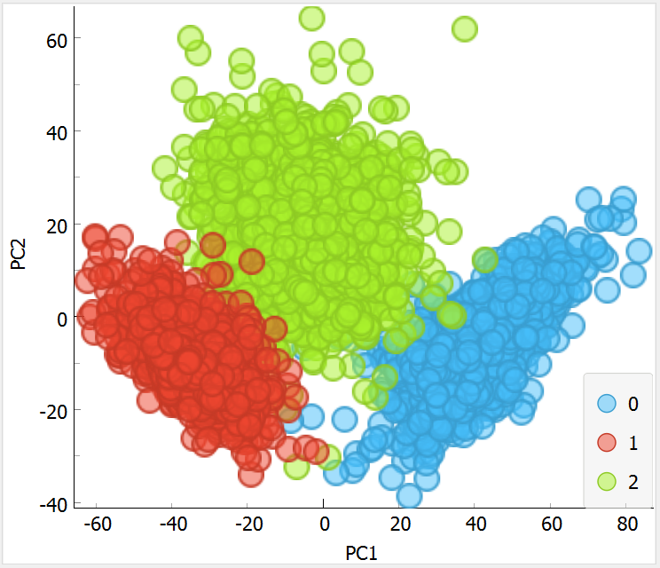
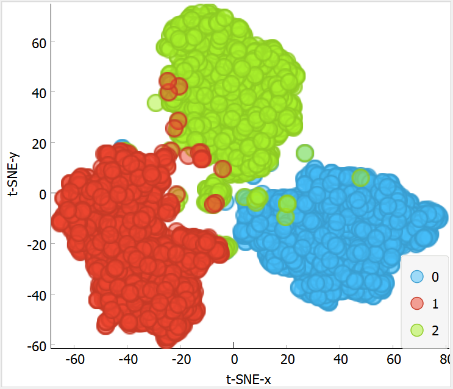
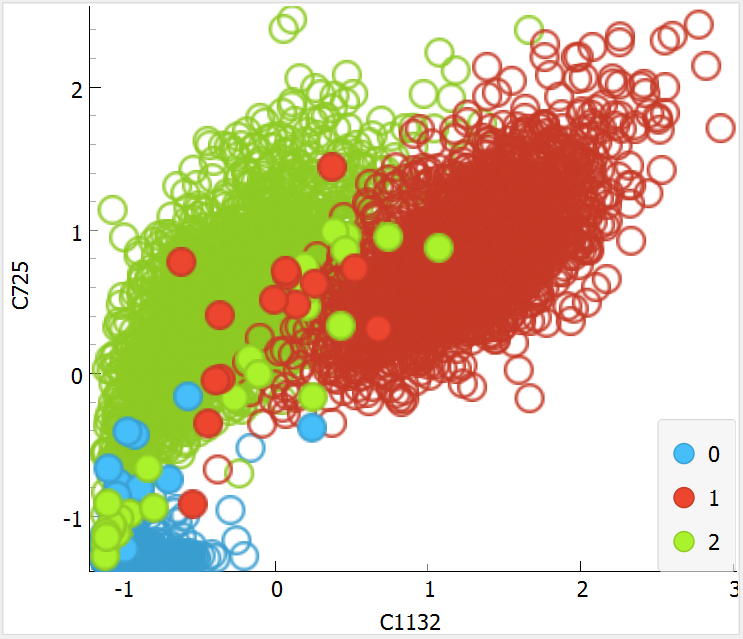

# Homework 1

Project made by (names)

## Basic workflow

The overall project is splitted in multiple stages, performed in parallel by each member optimizing Colab GPU resources

Each stage is driven by some instance of deep learning architecture, performing also some hyperoptimization and comparison with previous architectures, and focusing on searching for a good deep learning encoding of labeled images, as well as exploring different classifiers on top of it

### Stage 1 - Basic CNN
At the start of the project every group member started building his basic CNN based on small architectures, focusing on repetition of convolution and pooling layers but also exploring different patterns

### Stage 2 - VGG
Then we started moving to more structured convolutional architectures through transfer learning, and we first adopted VGG architecture

### Stage 3 - Inception & ResNet
More advanced architectures are tested, in particular Inception and ResNet models

### Stage 4 - InceptionResNet & NASNetLarge
Most advanced models measured was the ones based on InceptionResNet and NASNetLarge architectures

### Stage 5 - Hybrid classifier
Optimal models measured were based on the best deep encoder found and SVM or Random Forest as an optimized classifier on top of it; we also visualized the given best deep transformation found of the images

## Learning

During whole process learning rate was almost always equal to 1e-4, in general it was the right amount needed

### Stage 1
We started focusing on early stopped learning, but also tried some longer convergence train or cross validation; also l2 regularization and dropout on classifier are tested to counter some overfitting; also data augmentation is tested from the start, and tuning image transformations parameters; images size were fixed at 255x255x3

### Stage 2
As soon as we used transfer learning we've tried also to hyperoptimize parameters such as fine tuning and encoder parameters; with more experience we find early stopping pretty much very effective; also we started exploring each specific encoder architecture preprocessing

### Stage 3
We noticed using avg pooling on deep learned features in combination with high dropout and softmax as a classifier was very effective; also augmentation was found really effective almost always

### Stage 4
We increased images size to 299x299, we noticed fine tuned models were in general more performing than the others

## Performances

Measured accuracy ranges on test set based on different architectures used:

### Basic CNN
[60%, 70%]

### VGG
[75%, 85%]

### Inception & ResNet
[85%, 90%]

### InceptionResNet & NASNetLarge
[90%, 93%]

### Hybrid classifier
[91%, 94%]

## Optimal solution

Our optimal model was an InceptionResNet encoder with avg pooling, dropout 0.6 and 3 softmax; we optimized the classifier (dropout + softmax) on top of optimal trained deep encoder with a SVM classifier, gaining +0.7 accuracy on test set

2D PCA visualization of optimal deep encoder transformation

2D t-SNE visualization of optimal deep encoder transformation

2D informative projection of missclassified instances of SVM classifier

## Final considerations

We have understood how important is the underlying deep learning architecture for the overall quality of the model: for example we found Inception architecture having high performance gap with previous architectures, mainly due to the Inception module giving better scaling semantics to images